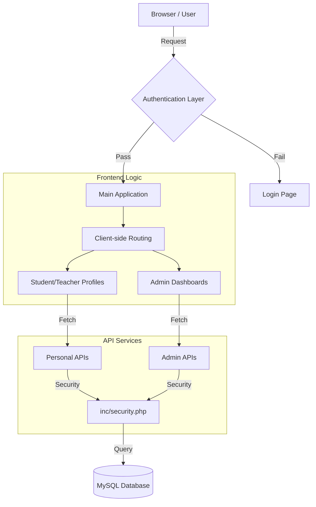

# Full System Architecture & Technical Review (CNP APP)

เอกสารฉบับนี้เป็นการทบทวนระบบทั้งหมดอย่างละเอียด เพื่อให้นักพัฒนาหรือผู้ดูแลระบบเข้าใจกลไกการทำงานในทุกมิติ

> [!TIP]
> สำหรับรายละเอียดโครงสร้างฐานข้อมูล (Schema) สามารถอ่านเพิ่มเติมได้ที่ [DATABASE.md](./DATABASE.md)

---

## 🏗️ 1. โครงสร้างระดับสูง (System Architecture)

ระบบถูกสร้างขึ้นด้วยสถาปัตยกรรม **Modern Monolith** ที่มีการแยกส่วน Frontend และ Backend ผ่าน API ชั้นกลาง:

### แผนผังการเชื่อมต่อ (System Flow)

---

## 🔐 2. ระบบความปลอดภัยและการเข้าถึง (Security & Auth)

### Authentication Mechanism
- **Session-based Auth**: ใช้ `session_start()` ใน PHP เพื่อจัดเก็บสถานะผู้ใช้
- **Role Validation**: ทุกไฟล์ API จะมีการตรวจสอบ `$_SESSION['role']` เพื่อป้องกันการเรียกใช้งานข้ามสิทธิ์ (เช่น นักเรียนพยายามเข้าถึง API ของแอดมิน)
- **Origin Check**: ฟังก์ชัน `cnp_verify_origin()` ตรวจสอบว่าคำขอมาจากโดเมนที่ได้รับอนุญาตเท่านั้น

### Data Protection
- **Prepared Statements**: ใช้ PDO ในการจัดการ SQL เพื่อป้องกัน **SQL Injection 100%**
- **CSRF Protection**: มีระบบตรวจสอบ Token สำหรับคำขอประเภท POST/DELETE
- **Input Sanitization**: ข้อมูลที่รับมาจากฟอร์มจะถูกกรองผ่านระบบจัดการ String ของ PHP ก่อนบันทึก

---

## 📂 3. เจาะลึกโครงสร้างไฟล์ (Detailed File Breakdown)

### 📁 โฟลเดอร์ `/inc` (Core Logic)
- **`config.php`**: เก็บค่าคงที่ทั้งหมด (DB Host, Credentials, App Settings)
- **`db.php`**: จัดการการเชื่อมต่อฐานข้อมูลแบบ Singleton เพื่อประสิทธิภาพสูงสุด
- **`security.php`**: รวมฟังก์ชันรักษาความปลอดภัยและการเช็ค Session
- **`classroom_codes.php`**: ตรรกะการแปลงรหัสห้องเรียน (Logic สำหรับรองรับข้อมูลห้องเรียนหลายรูปแบบ)

### 📁 โฟลเดอร์ `/api` (Service Layer)
- **`api/login.php`**: ตรวจสอบรหัสผ่าน (Password Hash) และสร้าง Session
- **`api/admin/update_student.php`**: หัวใจหลักของการจัดการข้อมูลนักเรียน รองรับทั้งการเพิ่มและแก้ไข พร้อมระบบ Whitelist ฟิลด์ข้อมูลที่เข้มงวด
- **`api/get-address.php`**: ให้บริการข้อมูลจังหวัด อำเภอ ตำบล และรหัสไปรษณีย์ สำหรับระบบ Smart Address
- **`api/timetable.php`**: ระบบค้นหาตารางสอนที่ซับซ้อน รองรับการกรองตามครู, ห้อง, และอาคาร

### 📁 โฟลเดอร์ `/views` (UI Layer)
- **`admin_students.html`**: ใช้เทคนิค **Template Strings** ใน JavaScript เพื่อสร้าง UI แบบไดนามิกโดยไม่ต้องรีโหลดหน้า
- **`student_profile.html`**: รวมตรรกะการคำนวณ **Completion integrity** โดยใช้ JSON Metadata ของฟิลด์ข้อมูล
- **`teacher_profile.html`**: ใช้ **HTML5 Canvas API** สำหรับระบบลายเซ็นดิจิทัล

---

## 🎨 4. ระบบการแสดงผลและ UI (UI/UX Logic)

### House Identity (คณะสี)
ระบบใช้ CSS Variables (`--house-color`) ในการควบคุมธีมสีของหน้าเว็บทั้งหมด:
- เมื่อเลือกคณะสี JavaScript จะเปลี่ยนค่า Variable นี้
- องค์ประกอบต่างๆ เช่น Header, Button, และ Indicator จะเปลี่ยนสีตามทันทีโดยอัตโนมัติ

### Profile Completion Algorithm
ตรรกะการคำนวณความสมบูรณ์ของข้อมูลในหน้า `student_profile.html`:
1. ระบบมีรายการ `essentialFields` (ฟิลด์ที่จำเป็น)
2. วนลูปตรวจสอบข้อมูลในฐานข้อมูล
3. คำนวณเป็นเปอร์เซ็นต์: `(จำนวนฟิลด์ที่มีข้อมูล / จำนวนฟิลด์ทั้งหมด) * 100` (ข้ามฟิลด์ที่เป็นค่าว่างหรือเครื่องหมาย "-")
4. แสดงผลผ่าน **SVG Animated Circle** พร้อมสถานะสี และรายการฟิลด์ที่ขาด (Missing Fields List)

---

## 📊 5. ระบบฐานข้อมูล (Database Schema)

*สำหรับรายละเอียดฟิลด์ทั้งหมด ดูได้ที่ [DATABASE.md](./DATABASE.md)*

### ตารางหลัก (Core Tables)
1. **`users`**: เก็บข้อมูลบัญชีผู้ใช้, รหัสผ่าน (Hashed), และระดับสิทธิ์
2. **`students`**: เก็บข้อมูลประวัติส่วนตัวนักเรียน (มีฟิลด์มากกว่า 130 ฟิลด์)
3. **`teachers`**: เก็บข้อมูลบุคลากรและประวัติการทำงาน
4. **`attendance`**: บันทึกการมาเรียนรายวัน
5. **`timetable`**: จัดเก็บโครงสร้างเวลาเรียนและผู้สอน

---

## 🚀 6. แนวทางการพัฒนาต่อ (Maintenance & Scaling)

- **การเพิ่มฟิลด์ข้อมูล**: หากต้องการเพิ่มข้อมูลในระบบ ให้เพิ่ม Column ในฐานข้อมูลก่อน จากนั้นจึงเพิ่ม Input ในฟอร์มของ `admin_students.html` และ `student_profile.html`
- **การจัดการรูปภาพ**: รูปภาพโปรไฟล์จะถูกเก็บไว้ที่ `/public/uploads/profile/` และเก็บ Path ไว้ในฐานข้อมูล
- **API Versioning**: แนะนำให้สร้างโฟลเดอร์ `api/v2/` หากมีการเปลี่ยนแปลงโครงสร้าง API ขนาดใหญ่ในอนาคต

---

*เอกสารฉบับนี้อัปเดตล่าสุดเมื่อ: 2026-05-16*
