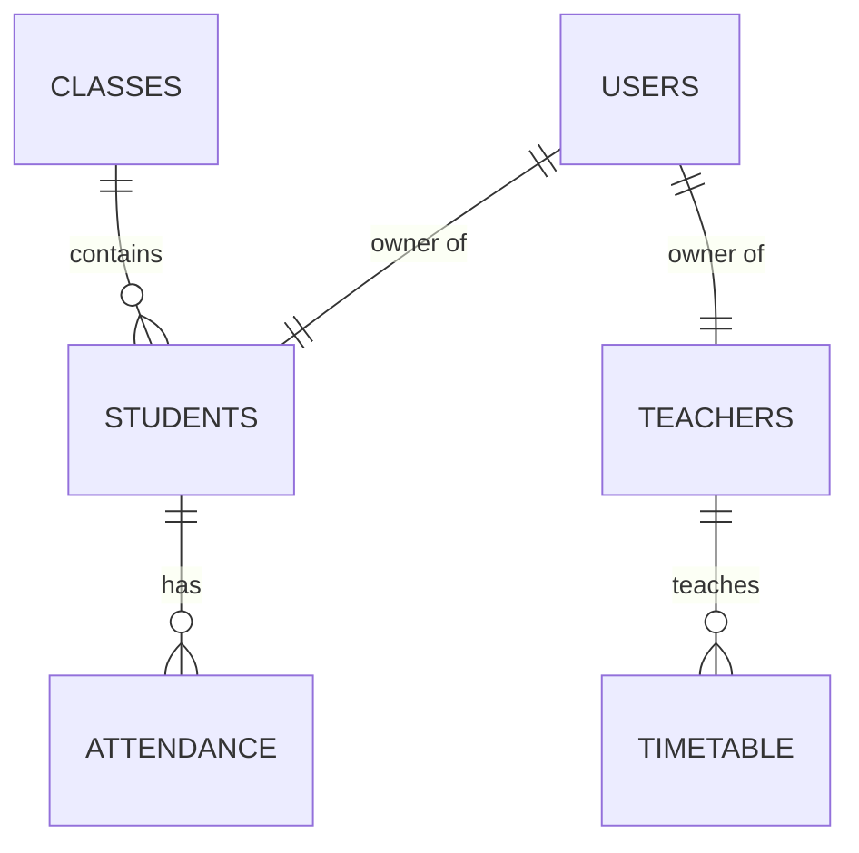

# Database Structure & Entity Review (CNP APP)

เอกสารฉบับนี้อธิบายโครงสร้างฐานข้อมูล ความสัมพันธ์ของข้อมูล และรายละเอียดของแต่ละตารางอย่างละเอียด

---

## 🗺️ 1. ภาพรวมโครงสร้าง (Schema Overview)

ฐานข้อมูลใช้เอนจิน **InnoDB** เพื่อรองรับความสัมพันธ์แบบ Foreign Keys และความปลอดภัยของข้อมูล (ACID)

---

## 📑 2. รายละเอียดตาราง (Table Details)

### 2.1 ตาราง `users` (ระบบสมาชิก)
ใช้สำหรับจัดการการเข้าสู่ระบบและสิทธิ์การใช้งาน
- `id`: Primary Key
- `username`: ชื่อผู้ใช้ (มักใช้รหัสนักเรียนหรือเลขประจำตัวครู)
- `password`: รหัสผ่านที่ผ่านการ Hash ด้วย `password_hash()`
- `role`: สิทธิ์การใช้งาน (`admin`, `teacher`, `student`)
- `is_active`: สถานะการใช้งาน (1 = ใช้งานได้, 0 = ระงับ)

### 2.2 ตาราง `students` (ประวัตินักเรียน)
ตารางที่มีขนาดใหญ่ที่สุด จัดเก็บข้อมูลกว่า 130 ฟิลด์ แบ่งเป็นหมวดหมู่ดังนี้:
- **ข้อมูลระบบ**: `student_id` (Text), `number_in_class` (Text), `class_name` (Enum/Text), `grade_level` (Enum)
- **ข้อมูลส่วนตัว**: `prefix`, `first_name_th`, `last_name_th`, `first_name_en`, `last_name_en`, `nickname`, `id_card`, `birth_date`, `birth_sex`, `gender` (Enum), `ethnicity` (Enum), `nationality` (Enum), `religion` (Enum), `child_order`
- **การติดต่อ**: `phone` (Auto-call formatted), `email` (@chainatpit.ac.th), `line_id`, `facebook`, `instagram` (IG)
- **ที่อยู่ (Address)**: 
  - ทะเบียนบ้าน (`reg_`): `house_no`, `moo`, `village`, `soi`, `road`, `subdistrict`, `district`, `province`, `zipcode`
  - ที่อยู่ปัจจุบัน (`curr_`): โครงสร้างเดียวกับทะเบียนบ้าน พร้อมฟิลด์ `address_status` สำหรับการดึงข้อมูลอัตโนมัติ
  - พิกัดและจุดสังเกต: `location_coords` (Lat,Long), `location_landmark`
- **สภาพความเป็นอยู่**: `house_type`, `house_style`, `house_condition`, `house_cleanliness`, `has_electricity`, `has_water`, `has_toilet`, `dist_to_school`, `travel_method`
- **ครอบครัว (Family)**: 
  - บิดา (`f_`): `prefix`, `name`, `age`, `phone`, `job`, `income`, `education`, `family_status`, `welfare`
  - มารดา (`m_`): โครงสร้างเดียวกับบิดา
  - ผู้ปกครอง (`g_`): `prefix`, `name`, `age`, `phone`, `job`, `income`, `guardian_relation`
- **ความสัมพันธ์และพี่น้อง**: `family_status` (ภาพรวม), `total_family_members`, `full_siblings`, `half_siblings`, `family_relationship`, `rel_father`, `rel_mother`, `rel_brothers`, `rel_sisters`, `rel_grandparents`, `rel_relatives`, `time_spent_together`, `allowance_source`, `allowance_per_day`, `responsibilities`, `caregiver_when_away`, `part_time_job`
- **สุขภาพและทักษะ**: `weight`, `height`, `blood_group`, `food_allergies`, `drug_allergies`, `congenital_disease`, `covid_vaccine`, `internet_access`, `social_media_usage`, `talents`, `interests`, `hobbies`

### 2.3 ตาราง `teachers` (ประวัติบุคลากร)
- `teacher_id`: รหัสประจำตัวครู
- `academic_standing`: วิทยฐานะ
- `department`: กลุ่มสาระการเรียนรู้
- `advisory_room_id`: เชื่อมโยงกับห้องที่ปรึกษา
- `signature`: เก็บ Path หรือ Base64 ของลายเซ็นดิจิทัล

---

## 🔑 3. ฟิลด์ข้อมูลที่สำคัญ (Critical Fields Mapping)

### ระบบคณะสี / คณะ (House/Faculty Enum)
ฟิลด์ `house` ในตาราง `students` ถูกกำหนดค่าเป็น ENUM เพื่อจำกัดข้อมูลให้ตรงตามคณะสีจริง (ในบางส่วนของระบบอาจเรียกฟิลด์นี้ว่า "คณะ" หรือ "Faculty"):
1. `ขุนสรรค์` (Pink)
2. `เจ้ายี่` (Green)
3. `ขุนศรี` (Red)
4. `ธรรมจักร` (Yellow)

### สถานะความสมบูรณ์ (Integrity Check Fields)
ฟิลด์ที่ระบบใช้คำนวณ Progress Bar ในหน้าโปรไฟล์ (ตัวอย่าง):
- `phone`, `email`, `id_card`, `birth_date`, `house`

---

## 🛠️ 4. ข้อแนะนำในการแก้ไขฐานข้อมูล

1. **การเพิ่ม Column**: ควรใช้คำสั่ง `ALTER TABLE` และกำหนด Default Value เสมอ เพื่อไม่ให้กระทบข้อมูลเดิม
2. **Indexing**: ฟิลด์ที่ใช้ค้นหาบ่อย เช่น `student_id`, `id_card`, และ `class_name` ควรมีการทำ Index เพื่อเพิ่มความเร็วในการดึงข้อมูล
3. **Character Set**: ควรใช้ `utf8mb4_unicode_ci` เพื่อรองรับภาษาไทยอย่างสมบูรณ์แบบ

---

*เอกสารฉบับนี้ช่วยให้เข้าใจโครงสร้างข้อมูลพื้นฐานสำหรับการ Query หรือพัฒนา Report เพิ่มเติม*
